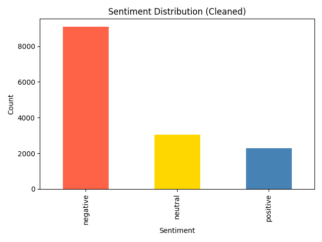
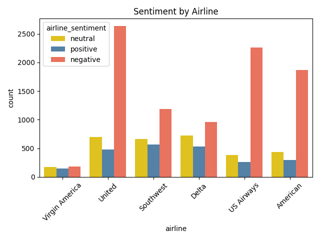
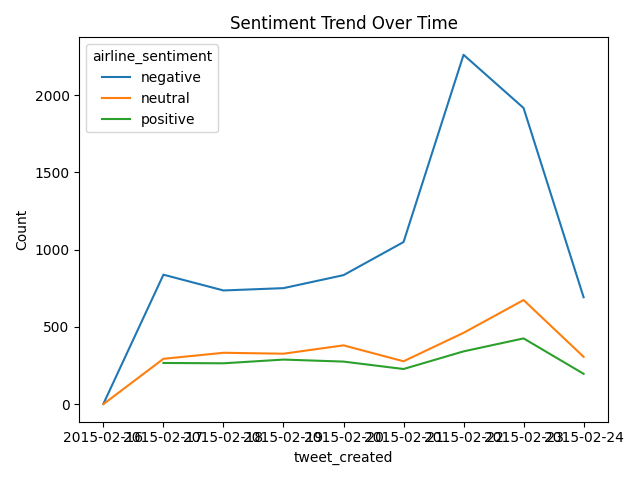
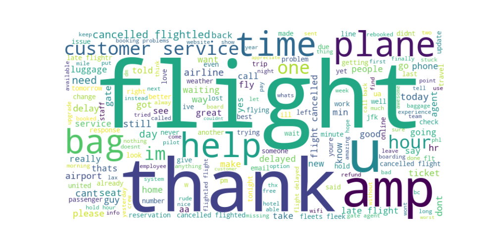

# social-media-sentiment-analysis
Analyze airline sentiment using Twitter data (Kaggle)

# ✈️ Social Media Sentiment Analysis

Analyze airline sentiment using Twitter data from Kaggle. This project explores customer feedback across major airlines using NLP and visual analytics.

---

## 📌 Project Overview

This report analyzes public sentiment toward airlines based on tweets from February 2015. It identifies key pain points, compares airline performance, and visualizes sentiment trends.

---

## 📊 Key Insights

- Negative sentiment dominates (64% of tweets)
- United, US Airways, and American Airlines received the most complaints
- Common issues: flight delays, cancellations, poor customer service
- Virgin America had the fewest mentions

---

## 🛠️ Tools Used

- Python (Pandas, Matplotlib, Seaborn)
- WordCloud
- Jupyter Notebook
- Git & GitHub

## 📊 Visualizations

### Sentiment Distribution

### Sentiment by Airline

### Sentiment Trend Over Time

### Word Cloud of Tweets

